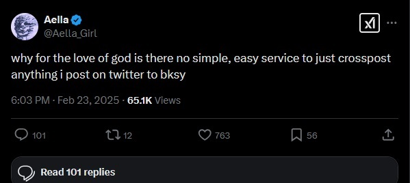

## SkyDaddy

It takes stuff from twitter and posts it on Bluesky. That's it. 

### Purpose

Honestly saw a tweet from a more interesting than usual e-girl and figured "hey why the hell not"

(The answer is that Twitter charges $200 to read more than 100 tweets a month, typefully already has a business model doing this, and frankly there's not enough ad revenue for something BlueSky exclusive to make it worth the spend for a Pro account)